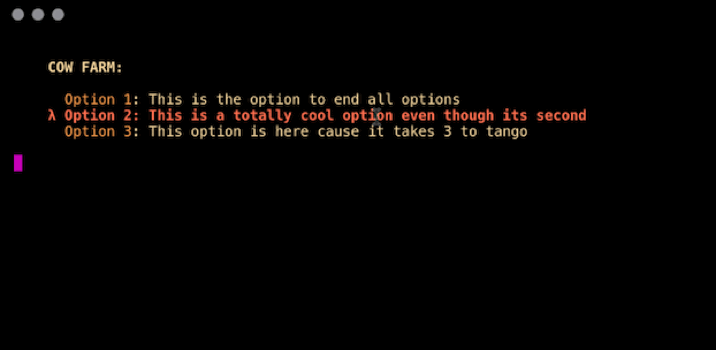

[](https://standardjs.com)
# cute-menu
Make your cli tools totally rad by giving people a damn menu 🐙


## Why
Cause not everyone can keep track of all those fancy commands your cli tool has.

Inspired by (and a lot of code borrowed from)  [lana-cli](https://github.com/paprikka/lana-cli).

## Install
`$ npm install cute-menu --save-dev`

## Usage
```js
const Menu = require('cute-menu')
const chalk = require('chalk')

/* You need to pass in an options array and a config object. For examples refer to the `example.js` file
*/
let menu = new Menu(options, config);
menu.show()
```

## Tips
+ [chalk](https://github.com/chalk/chalk)
+ [keypress](https://www.npmjs.com/package/keypress)
+ [get-stdin](https://github.com/sindresorhus/get-stdin)
